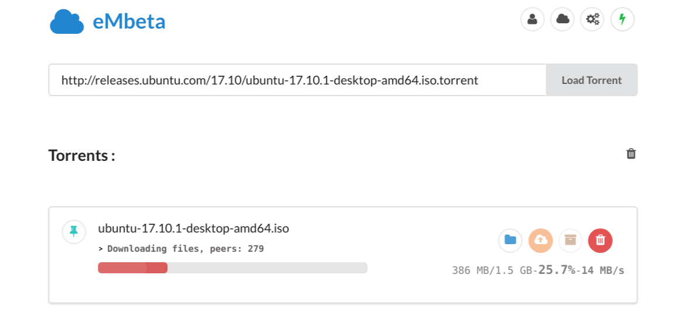

# eMbeta Cloud
New concept to directly upload files from server to Google Drive.
It will give you a proxy and will automatically download files to server, after which you can easily upload it Google Drive or download it
to your PC.

Somebody is requested to upload it to a high-speed server so that it's made open to all.

# Features
- Single Page UI (made with semantic-ui and angularJS)
- Responsive UI
- Realtime information update
- Support for **torrents**
- Can upload complete folders to Google Drive with click of a button
- Zip and download torrents
- Zip and upload torrents to Drive
- Auto-Upload to GDrive on completion
- Multiple Cloud Storage support, currently : 
    - Google Drive
    - Mega

# Usage
First clone the repo and install dependencies:
```js
npm install
```
You have to make a google developers project and set the following environment variables:
- GOOGLE_CLIENT_ID
- GOOGLE_CLIENT_SECRET
- GOOGLE_REDIRECT_URL (it should be &lt;server address&gt;/oauthCallback by default)
  
Other environment variables:
- TBP_PROXY: piratebay proxy to use (default: `https://thepiratebay.org`)

Ensure that you request full google drive access permission and basic G+ info in your google project 

To start server, run:
```js
npm start
```
<h2>For Heroku:</h2>
<i>Heroku is no longer supported.</i>

<h2> For Docker: </h2>
`docker run -d -p 3000:3000 -e GOOGLE_CLIENT_ID='***' 
-e GOOGLE_CLIENT_SECRET='***' 
-e GOOGLE_REDIRECT_URL='***'
mrigank11/embetacloud node server/server.js`

Fill `***` with appropriate values.

If you want to debug, add `-e DEBUG='eMCloud:*'` and remove the `-d`

# Debugging
eMbeta Cloud is [debug](https://github.com/visionmedia/debug) compatible, to get debug info set environment variable `DEBUG=eMCloud:*`
and start server.

# Upcoming Features
- Incognito mode

# How to contribute
- Add new Cloud Storage
- Find bugs and report them
- Suggest new features
- Fix bugs

# How to add Cloud Storage
Adding new clouds is easy, just follow these steps:

1. Create new folder inside `/server/Storages/` (e.g. `/server/Storages/DropBox`) and add `.ts` file to it with same name as that of folder (say `/server/Storages/DropBox/Dropbox.ts`)
2. Now you've to write your code in that file, the template is 

```ts
export class CloudName extends EventEmitter{
    constructor(credentials){
        super();
        //store credentials, they can be username/password or OAuth Tokens etc.
    }
    static getURL(){
        //return the url on which the user will be redirected for credentials, can be OAuth Consent Page or a page on server itself.
    }
    static callbackHandler(query,callback){
        //handle the recieved credentials, 'query' contains the GET params. (like for OAuth, authentication code is 'query.code')
        //after successfull authenticaltion, return creds to 'callback' to be stored as session variable
        //if authentication fails, call the callback as: callback(0)
        // when user requests a file upload, credentials from session will be used to initialize this class (the constructor will be called)
    }
    public uploadFile(readStream, totalSize, mime, filename){
        //handle the upload procedure
        //it should emit => progress        : {name,bytesUploaded,size}
        //                  fileUploaded    : {size, name , error} 
    }
    public uploadDir(localFolderPath){          //not necessary
        //upload a local directory
        //should emit    => addSize    : size      size in bytes to be added to total upload size
        //may emit       => mkdir      : name      name of cloud directory created
    }
}
``` 

For example, see `/server/Storages/GDrive/GDrive.ts`

3. Add new storage to `/server/Storages/Storages.ts` (import it and add in `storages` object)
4. Compile typescript

When user clicks `login`, url is generated by calling `getURL()`, it may be OAuth Consent Page or a custom one.
After redirection from OAuth Page(maybe other also), user is redirected to `/oauthcallback/` with credentials as GET paramaters, `callbackHandler(query)` is called with these params. After Successfull login, credentials passed to `callback` are stored as session variables which are used to initialize this class i.e. constructor will be called with these creds.

`getURL()` may redirect url to custom page. For Example: returning `/login/mega` will open `/server/Storages/mega/login.html`
"# beta-cloud1" 
